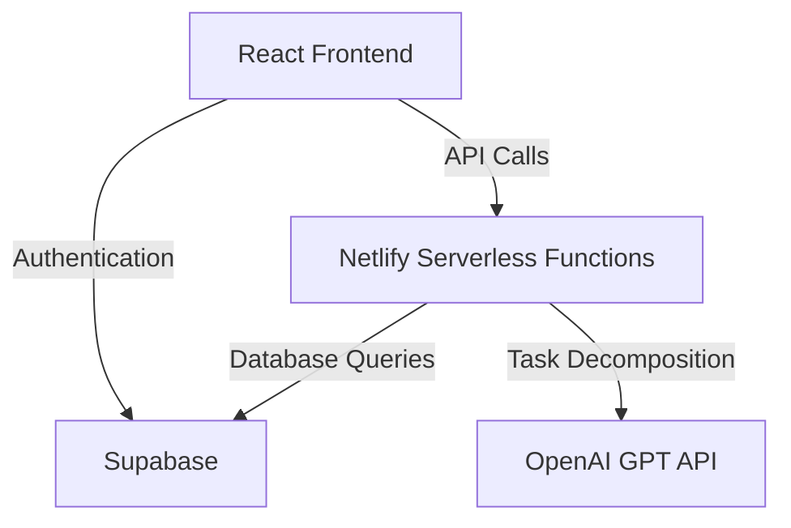

# ADHD Task Management System MVP: Architecture Overview

## High-Level Architecture

## 1. Frontend: React

**Why React?**

1. **Component-Based Architecture**:
    - Aligns with ADHD needs for modular, focused interfaces.
    - Allows for easy isolation and management of specific task-related components (e.g., TaskList, TaskItem, PrioritySelector).
    - Supports rapid iteration on individual features without affecting the entire application.
2. **Virtual DOM**:
    - Enables smooth, responsive UIs, reducing cognitive load during interactions.
    - Crucial for ADHD users who may be sensitive to lag or unresponsive interfaces.
3. **Rich Ecosystem**:
    - Provides access to ADHD-friendly UI components and accessibility tools.
    - Allows for quick implementation of features like drag-and-drop prioritization or visual timers.
4. **Unidirectional Data Flow**:
    - Simplifies state management, which is crucial for maintaining a clear task hierarchy and priority system.
    - Reduces bugs related to inconsistent state, a particular pain point for ADHD users who may struggle with system complexity.

## 2. Backend: Netlify Serverless Functions

**Why Serverless?**

1. **Reduced Cognitive Overhead**:
    - Eliminates the need for server management, allowing developers to focus on ADHD-specific features.
    - Simplifies deployment and scaling, which is crucial for maintaining momentum in development.
2. **Automatic Scaling**:
    - Accommodates unpredictable usage patterns common in ADHD users.
    - Ensures the system remains responsive during peak usage times (e.g., during hyperfocus periods or deadline rushes).
3. **Cost-Effectiveness**:
    - Pay-per-use model is ideal for MVP stage, allowing for cost control while validating the product.
    - Aligns with the potentially irregular usage patterns of ADHD users.
4. **Rapid Development and Deployment**:
    - Enables quick iterations and feature additions, crucial for adapting to ADHD user feedback.
    - Integrates seamlessly with the frontend deployment on Netlify, simplifying the overall architecture.

## 3. Database: Supabase

**Why Supabase?**

1. **Simplified Backend Complexity**:
    - Provides a user-friendly interface for database management, reducing cognitive load on developers.
    - Offers built-in APIs, eliminating the need for custom API development for basic CRUD operations.
2. **Real-time Capabilities**:
    - Supports immediate task updates across devices, enhancing the responsiveness crucial for ADHD users.
    - Enables features like collaborative task management or instant priority updates.
3. **Built-in Authentication**:
    - Reduces development time for user management features.
    - Provides secure, out-of-the-box solutions for multi-device access, a common need for ADHD users who may switch between devices frequently.
4. **PostgreSQL Backend**:
    - Offers a robust, scalable database solution that can grow with the application.
    - Provides advanced querying capabilities for future features like complex task relationships or time-based analytics.

## 4. Task Decomposition: OpenAI GPT API

**Why External AI for Task Decomposition?**

1. **Addresses Core ADHD Challenge**:
    - Provides intelligent assistance in breaking down complex tasks, a common struggle for ADHD individuals.
    - Reduces the initial barrier to task initiation by offering clear, actionable steps.
2. **Scalability and Maintenance**:
    - Leveraging an external API allows for continuous improvements without needing to update the core application.
    - Ensures access to state-of-the-art language models without the overhead of maintaining ML infrastructure.
3. **Customization Potential**:
    - Can be fine-tuned or prompted to understand ADHD-specific task management needs.
    - Allows for future personalization based on individual user patterns and preferences.

## Why This Architecture Works for ADHD Users

1. **Responsiveness**:
    - The combination of React's efficient rendering and serverless backend ensures a snappy interface, crucial for maintaining ADHD user engagement.
2. **Flexibility**:
    - Serverless functions and Supabase allow for easy addition of features, enabling rapid response to user feedback and evolving ADHD management strategies.
3. **Reliability**:
    - Distributed architecture reduces single points of failure, ensuring task data is always accessible—critical for ADHD users who may rely heavily on external memory aids.
4. **Scalability**:
    - The architecture can easily grow from handling a single user's tasks to supporting collaborative features or large-scale data analysis for ADHD research.
5. **Security**:
    - Supabase and Netlify provide robust security features out-of-the-box, protecting potentially sensitive task and personal data.
6. **Offline Potential**:
    - While not implemented in the MVP, React and Supabase's architecture allows for future offline functionality, crucial for ADHD users in variable connectivity situations.