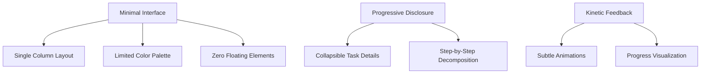

# Product Context: foow - ADHD Task Management System

## Core User Needs

1. **Task Initiation**

   - Reduce activation energy for starting tasks
   - Clear visual hierarchy of priorities
   - Guided structure for task definition

2. **Focus Maintenance**

   - Prevent context switching
   - Minimize decision fatigue
   - Visual time awareness without pressure

3. **Memory Support**
   - Persistent task storage across devices
   - Clear status tracking
   - Recovery path for interrupted work

## Resolved Design Decisions

1. **Task Durations**

   - Store relative durations from creation time
   - Convert to absolute timestamps only for display purposes

2. **Urgency Handling**

   - Prototype phase excludes urgency sorting
   - Future implementation will use priority-based scoring

3. **Decomposition Architecture**
   - Server-side processing via Netlify Functions
   - Client handles only UI/UX presentation

## Key UX Principles

