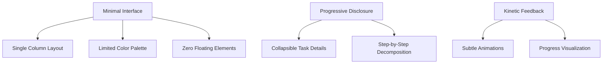

# Product Context: foow - ADHD Task Management System

## Core User Needs (ADHD-Specific)

1. **Task Initiation**

   - "Wall of Awful" reduction through microtasking
   - Time blindness compensation via relative durations
   - Paralysis prevention through AI decomposition

2. **Focus Maintenance**

   - Hyperfocus support with auto-extend timers
   - Distraction logging for post-interruption recovery
   - Kinetic scrolling to maintain physical engagement

3. **Emotional Regulation**

   - Progress visualization for dopamine reinforcement
   - Error-tolerant UI with undo everywhere
   - Anxiety reduction through clear exit points

4. **Memory Support**
   - Persistent task storage across devices
   - Clear status tracking
   - Recovery path for interrupted work

## Resolved Design Decisions

1. **Task Durations**

   - Store relative durations from creation time
   - Convert to absolute timestamps only for display purposes

2. **Urgency Handling**

   - Prototype phase excludes urgency sorting
   - Future implementation will use priority-based scoring

3. **Decomposition Architecture**
   - Server-side processing via Netlify Functions
   - Client handles only UI/UX presentation

## Key UX Principles

