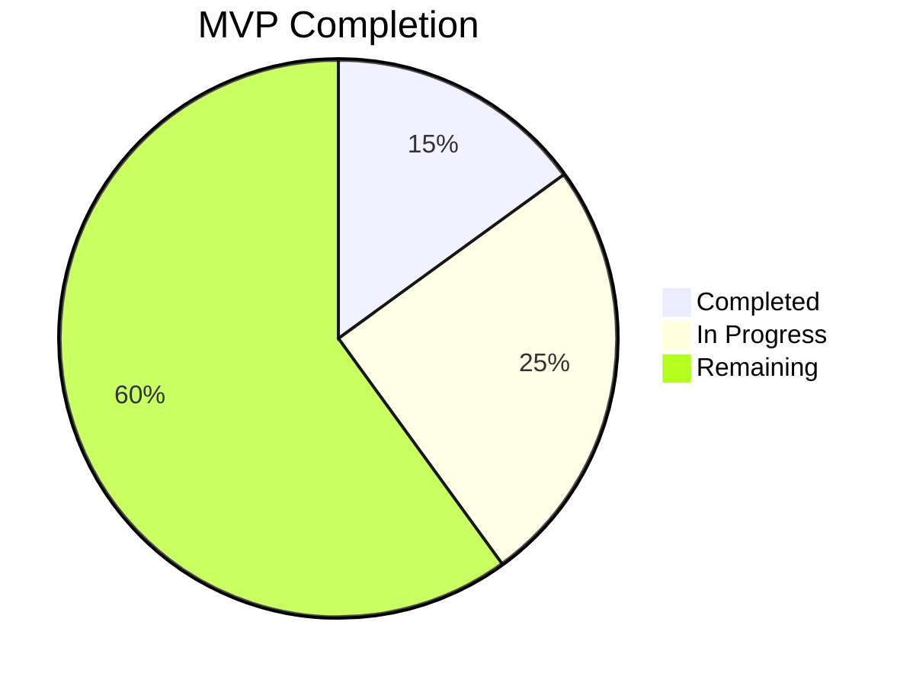

# Progress Tracking: foow - Task Management System

## Completed Features
✅ **Project Setup**
- GitHub repository created
- Basic .gitignore configured
- Initial documentation started
- Memory bank initialized

## In Progress
🛠 **Environment Configuration**
- Netlify project setup (50%)
- Local React development (30%)
- Supabase configuration (20%)

## Up Next
📅 **Immediate Tasks**
1. Complete Netlify deployment setup
2. Finish React scaffolding
3. Implement Supabase authentication
4. Create basic task interface

## Remaining MVP Features
### Core Functionality
- [ ] Task creation with AI decomposition
- [ ] Manual priority assignment
- [ ] Deadline tracking
- [ ] Single-task focused view
- [ ] Work/break timer

### Technical Implementation
- [ ] Supabase real-time subscriptions
- [ ] OpenAI API integration
- [ ] Serverless function deployment
- [ ] End-to-end testing

## Current Status

## Known Issues
1. Need to finalize OpenAI API key handling
2. Supabase schema design requires review
3. Testing strategy needs definition

## Recent Testing Results
- Basic repo setup verified
- Initial docs reviewed
- Memory bank structure validated
