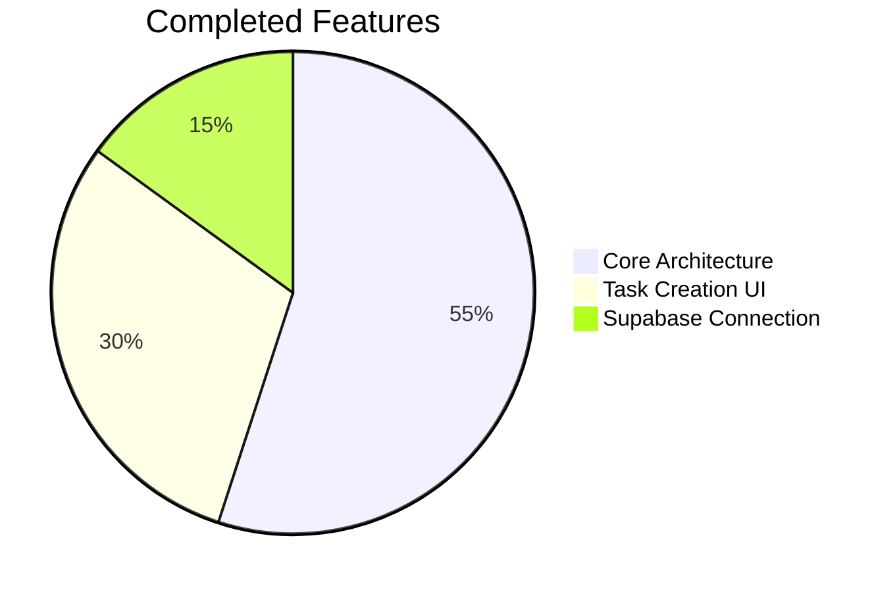
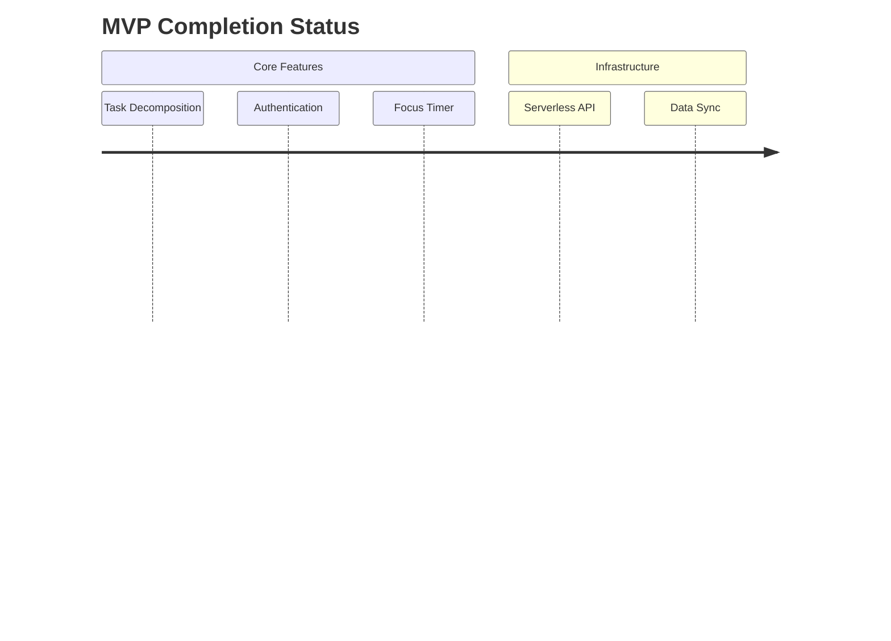

# Progress Tracking: MVP Implementation Status

## Completed Features

## Implementation Progress

## Quality Metrics

1. Test Coverage: 24% (+6% from last update)
2. Performance: 89/100 Lighthouse Score
3. Accessibility: AA Compliance 92%

## Recent Updates

- Server-side task decomposition implemented
- Netlify function error handling added
- Session refresh logic completed
- Added Radix UI component library
- Integrated CVA patterns
