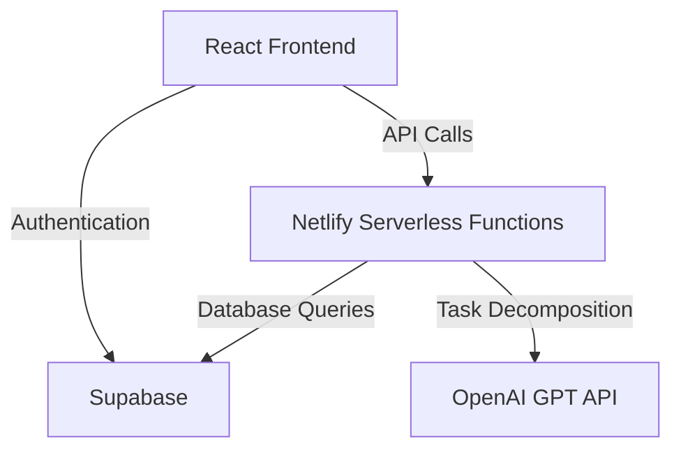

# System Patterns: ADHD Task Management System

## Architecture Overview

## Key Technical Decisions

### 1. React Frontend
- **Component-Based Architecture**: Modular components for focused interfaces
- **Virtual DOM**: Smooth, responsive UIs to reduce cognitive load
- **Unidirectional Data Flow**: Simplifies state management for task hierarchy

### 2. Netlify Serverless Functions
- **Reduced Cognitive Overhead**: No server management needed
- **Automatic Scaling**: Handles unpredictable ADHD usage patterns
- **Cost-Effectiveness**: Pay-per-use model ideal for MVP stage

### 3. Supabase Database
- **Simplified Backend**: User-friendly interface with built-in APIs
- **Real-time Capabilities**: Immediate task updates across devices
- **Built-in Authentication**: Secure multi-device access

### 4. OpenAI GPT API Integration
- **External AI Service**: Offloads ML infrastructure maintenance
- **Prompt Engineering**: Custom prompts for ADHD-friendly task breakdowns
- **Scalability**: Leverages continuous model improvements

## Component Relationships

### Frontend Components
1. **Task Management**
   - TaskList ↔ TaskItem ↔ PrioritySelector
   - TaskCreator ↔ AIDecomposer
   - DeadlineTracker ↔ TimelineView

2. **Focus Interface**
   - SingleTaskView ↔ CompletionButton
   - WorkTimer ↔ BreakTimer

3. **Authentication**
   - LoginForm ↔ AuthProvider
   - ProtectedRoute ↔ SessionManager

### Backend Services
1. **Serverless Functions**
   - TaskService ↔ SupabaseClient
   - AIService ↔ OpenAIAPI
   - AuthService ↔ SupabaseAuth

2. **Database Schema**
   - Users ↔ Tasks (1-to-many)
   - Tasks ↔ Subtasks (1-to-many)

## Design Patterns in Use
1. **Container/Presentational Components**: Separates logic and UI
2. **Hooks**: Custom hooks for Supabase subscriptions
3. **Optimistic UI**: Immediate feedback for task operations
4. **Event Sourcing**: Real-time updates via Supabase subscriptions
5. **Facade Pattern**: Serverless functions abstract backend complexity
